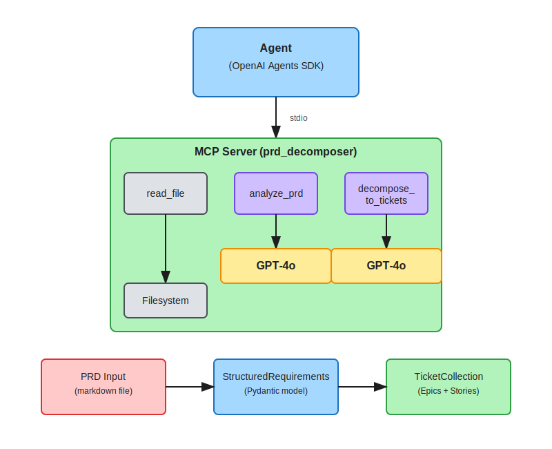

# PRD Decomposer

An MCP server that analyzes Product Requirements Documents (PRDs) and decomposes them into Jira-ready epics and stories.

Built with [arcade-mcp](https://github.com/ArcadeAI/arcade-mcp).

## The Problem

Most engineering teams share the same broken workflow: a PM writes a PRD in Google Docs, an EM or tech lead manually translates it into Jira epics and stories, requirements change but tickets don't, and inevitably things get lost in the mix. Someone ends up spending hours playing human ETL—keeping docs, tickets, and stakeholder expectations in sync.

## The Solution

An MCP server that gives AI agents the ability to analyze a PRD, extract structured requirements, identify gaps and ambiguities, and decompose the whole thing into ready-to-create epics and stories—structured in a format that can feed directly into Jira. The agent handles the translation layer so humans don't have to.

## Architecture



## Tools

### `read_file`

Reads a file from the filesystem (restricted to working directory for security).

**Input:** File path (relative to working directory)
**Output:** File contents as string

### `analyze_prd`

Analyzes raw PRD text and extracts structured requirements.

**Input:** PRD markdown text
**Output:** Structured requirements with:
- Unique IDs (REQ-001, REQ-002, etc.)
- Acceptance criteria
- Dependencies between requirements
- Ambiguity flags (missing criteria, vague quantifiers like "fast", "scalable", "user-friendly")
- Priority levels (high/medium/low)

### `decompose_to_tickets`

Converts structured requirements into Jira-compatible tickets.

**Input:** Structured requirements from `analyze_prd` (required)
**Output:** Epics and stories with:
- Clear titles and descriptions
- Acceptance criteria
- T-shirt sizing (S/M/L)
- Labels
- Traceability back to requirements

## Features

### Security
- Path traversal protection restricts file access to working directory
- Symlink resolution prevents bypass attacks
- Input length limits prevent resource exhaustion (`PRD_MAX_PRD_LENGTH`)
- Rate limiting prevents API quota exhaustion (`PRD_RATE_LIMIT_CALLS`, `PRD_RATE_LIMIT_WINDOW`)
- XML delimiters in prompts help LLMs distinguish instructions from user content

**Note on Prompt Injection:** Like all LLM-based tools, this system is susceptible to prompt injection attacks where malicious content in PRDs could attempt to manipulate LLM behavior. Mitigations include input length limits and structural delimiters, but these are not foolproof. Do not use with untrusted input in security-sensitive contexts.

### Reliability
- Automatic retry with exponential backoff for rate limits and connection errors
- Graceful error handling with clear error messages

### Observability
- Token usage tracking in metadata (`prompt_tokens`, `completion_tokens`, `total_tokens`)
- Prompt versioning for traceability (`PROMPT_VERSION`)
- Generation timestamps and model info in outputs

### Configuration
Environment variables with `PRD_` prefix (via pydantic-settings):
- `PRD_OPENAI_MODEL` - Model to use (default: `gpt-4o`)
- `PRD_ANALYZE_TEMPERATURE` - Temperature for analysis (default: `0.2`)
- `PRD_DECOMPOSE_TEMPERATURE` - Temperature for decomposition (default: `0.3`)
- `PRD_MAX_RETRIES` - Max retry attempts, 1-10 (default: `3`)
- `PRD_INITIAL_RETRY_DELAY` - Initial retry delay in seconds, 0-60 (default: `1.0`)
- `PRD_LLM_TIMEOUT` - Timeout for LLM API calls in seconds, 1-300 (default: `60`)
- `PRD_MAX_PRD_LENGTH` - Maximum PRD text length in characters, 1000-500000 (default: `100000`)
- `PRD_RATE_LIMIT_CALLS` - Maximum LLM calls per window, 1-1000 (default: `60`)
- `PRD_RATE_LIMIT_WINDOW` - Rate limit window in seconds, 1-3600 (default: `60`)

## Key Decisions

| Decision | Choice | Rationale | Alternative Considered |
|----------|--------|-----------|------------------------|
| **Language** | Python | Arcade's SDK, CLI, and eval framework are Python. Fighting the toolchain wastes time. | TypeScript (team uses it day-to-day, but Arcade tooling is Python-first) |
| **Data Validation** | Pydantic models | Self-documenting, validates inputs/outputs, plays well with Arcade's type annotations | Plain dicts (faster to write but harder to validate) |
| **LLM Provider** | OpenAI (gpt-4o) | Agent layer uses OpenAI Agents SDK; single provider keeps dependency surface clean | Anthropic Claude (would also work) |
| **Agent Framework** | OpenAI Agents SDK | Production experience from building multi-agent systems; less framework wrangling | LangGraph (Arcade has examples, but "any framework" was allowed) |
| **MCP Transport** | stdio | Arcade's default for local dev, simplest setup, what eval framework expects | HTTP (more production-realistic but adds complexity) |
| **External APIs** | None (no Jira/Google OAuth) | Tools are the intelligence layer; output is Jira-compatible schema that composes with Arcade's Jira toolkit | Real Jira/Google OAuth (risky time sink) |
| **Prompt Management** | Separate `prompts.py` | Keeps prompts testable, iterable, reviewable separately from tool logic | Inline prompts in tool functions |
| **Configuration** | pydantic-settings with `PRD_` prefix | Runtime config without code changes; environment variables are 12-factor compliant | Hardcoded values or config files |
| **Testability** | Dependency injection for LLM client | Tests can inject mock clients directly; no patching required | Global client with `@patch` decorators |
| **Prompt Quality** | Few-shot examples in prompts | Improves LLM output consistency for ambiguity detection and story decomposition | Zero-shot prompts (less consistent) |
| **MCP Tool Parameters** | JSON string for complex types | `dict` parameters weren't passed correctly by OpenAI agent; strings are more portable | `dict` type annotation (caused None values) |
| **Retry Config** | Bounded validation (1-10 retries, 0-60s delay) | Prevents invalid env var values from causing runtime failures | Unbounded (accepts any value) |
| **Path Security** | Symlink resolution + allowlist | Prevents path traversal attacks even through symlinked directories | Basic path checking (bypassable) |

## Setup

### Prerequisites

- Python 3.11+
- [uv](https://github.com/astral-sh/uv) package manager
- OpenAI API key

### Installation

```bash
# Clone the repository
git clone https://github.com/samkujovich/prd-decomposer.git
cd prd-decomposer

# Install dependencies
uv sync --all-extras

# Set OpenAI API key
export OPENAI_API_KEY="your-key-here"
```

## Usage

### Interactive Agent

```bash
uv run python agent/agent.py
```

Then:
```
You: analyze samples/sample_prd_01_rate_limiting.md
# ... shows requirements and ambiguity flags ...

You: jira tickets
# ... generates epics and stories ...
```

### Batch Processing (All 10 Sample PRDs)

```bash
uv run python scripts/run_all_prds.py
```

Processes all sample PRDs and saves results to `outputs/`:
- `*_requirements.json` - extracted requirements
- `*_tickets.json` - Jira epics/stories
- `summary.json` - aggregated metrics

### Run the MCP Server Standalone

```bash
# stdio mode (default, used by the agent)
uv run python src/prd_decomposer/server.py

# HTTP mode (for remote/network access - advanced use)
# uv run python src/prd_decomposer/server.py http
```

> **Note**: The agent uses stdio transport by default. HTTP mode is supported by arcade-mcp for remote access scenarios but is not covered by the test suite.

### Run Tests

```bash
# Unit tests (67 tests, 98% coverage)
uv run pytest tests/ -v

# With coverage report
uv run pytest tests/ --cov=prd_decomposer --cov-report=term-missing
```

## Sample PRDs

10 diverse PRDs for testing different domains and ambiguity patterns:

| # | PRD | Ambiguity Pattern |
|---|-----|-------------------|
| 1 | API Rate Limiting | Vague: "scalable", "user-friendly" |
| 2 | User Onboarding | Clear requirements |
| 3 | E-commerce Checkout | Vague: "seamless", "quick" |
| 4 | Notification System | Clear requirements |
| 5 | Analytics Dashboard | Vague: "acceptable" metrics |
| 6 | File Upload Service | Clear technical specs |
| 7 | Search Feature | Vague: "relevant", "fast" |
| 8 | Subscription Billing | Clear business rules |
| 9 | Webhook System | Clear technical spec |
| 10 | Mobile Push | Vague: "significant", "good" |

## Project Structure

```
prd-decomposer/
├── src/prd_decomposer/
│   ├── __init__.py       # Public exports
│   ├── server.py         # MCP server + tool definitions
│   ├── models.py         # Pydantic models
│   ├── prompts.py        # LLM prompt templates
│   └── config.py         # Settings via environment variables
├── agent/
│   └── agent.py          # OpenAI Agents SDK consumer
├── scripts/
│   └── run_all_prds.py   # Batch processing script
├── tests/
│   ├── test_tools.py     # Model tests
│   ├── test_server.py    # Server/tool tests (mocked LLM)
│   ├── test_prompts.py   # Prompt template tests
│   └── test_config.py    # Configuration tests
├── samples/
│   └── sample_prd_*.md   # 10 sample PRDs
├── outputs/              # Generated JSON outputs (gitignored)
├── CLAUDE.md             # Project coding standards
└── AI_USAGE.md           # AI attribution
```

## Future Iterations

### Document Source Integrations
Currently PRDs must be local markdown files. Future versions could pull directly from:
- **Google Docs** - Where most PRDs live in practice
- **Notion** - Popular for product teams
- **Confluence** - Enterprise standard

### Jira Integration
Output is currently Jira-compatible JSON. Next step: actual ticket creation via Atlassian API, composing with [Arcade's Jira toolkit](https://docs.arcade.ai/tools/atlassian).

### Auto-Commenting on Ambiguities
When the tool flags something as ambiguous, automatically leave a comment on the source document (Google Docs comment, Notion comment, Confluence inline comment) asking for clarification—closing the feedback loop without human copy-paste.

### Expanded Analysis Categories
Ambiguity detection is just the start. The same pattern could flag:
- **Incompleteness** - Missing sections (error handling, edge cases, rollback plan)
- **Edge case coverage** - Scenarios the PRD doesn't address
- **Design questions** - Technical decisions that need engineering input before implementation
- **UX concerns** - Flows that might frustrate users (too many steps, unclear affordances)
- **Security considerations** - Auth, data handling, PII that needs review

### Continuous Sync & Bidirectional Updates
Run agents continuously to keep PRDs and Jira in sync:
- **PRD → Jira**: When a PRD changes, automatically detect deltas and update/create tickets
- **Jira → PRD**: When ticket status changes (in progress, blocked, complete), reflect it back in the PRD
- **Real-time status dashboard**: Product and non-technical stakeholders see live implementation status tied to the high-level requirements doc—no more "what's the status of X?" meetings

## License

MIT
